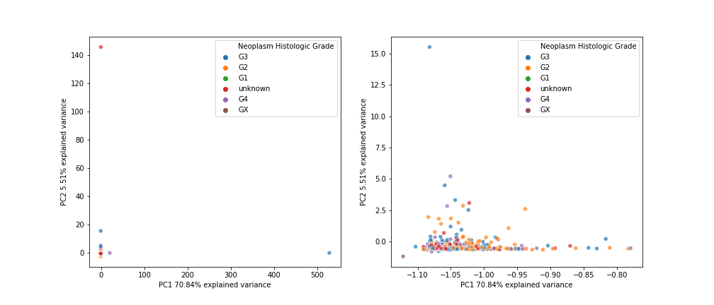
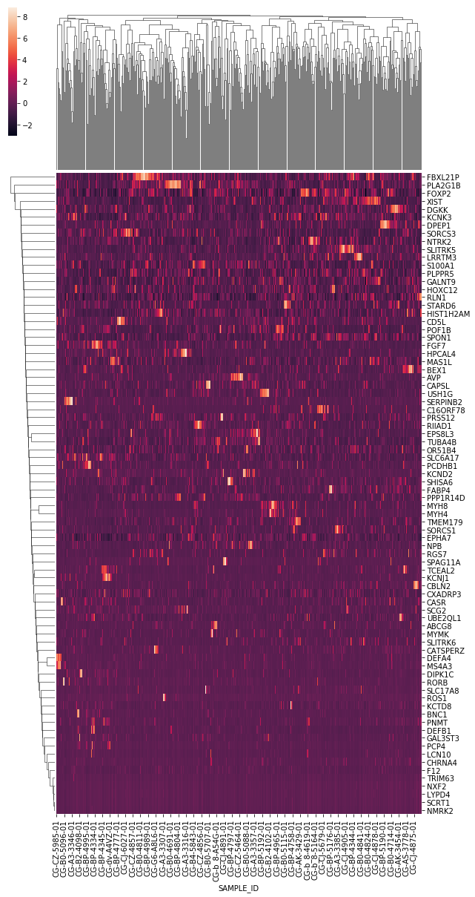
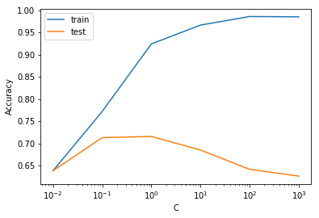
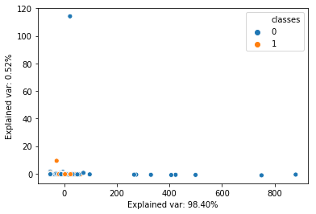
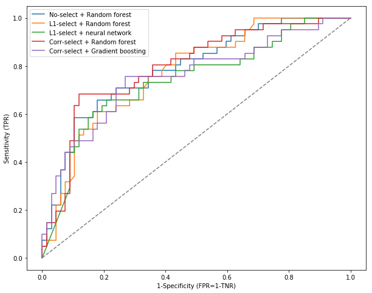

# Convergent Genomics Data Science Challenge
## The Challenge
It is the mission of Convergent Genomics to bring clear and actionable insight to cancer patients and their physicians. One way you can support this mission is by leveraging the combination of clinical, laboratory, and sequencing data to create algorithms or classifiers that help diagnose disease and better understand risk, or aggressiveness of a patient’s cancer. Through this challenge we are providing you an opportunity to demonstrate the raw power of your data ninja skills on a real world human cancer genomic and clinical feature dataset. Using the associated clear cell kidney cancer data sets provided, construct a program in python and/or R that:
1. Uses your choice of regression, clustering, or dimensionality reduction approaches to identify features underlying disease-associated risk.
2. Using best practices, create a classification algorithm that predicts risk.
3. Compare and contrast the optimal features identified in tasks 1 & 2.

## Target
- Utilize unsupervised clustering to create a label reflecting disease-associated risk from cancer stage, grade, overall survival in days following diagnosis, and vital status (alive/dead).
- Clean and QA/QC of clinical, mRNA and mutation data as well as fill in missing data.
- Train the model to predict risk using clinical, mRNA and mutation data

## Learning methods for classification
      1. Logistic regression
      2. SVM 
      3. Random forest 
      4. Gradient boosting
      5. Neural network

## Clean data and deal with missing data
### Clinical data
1. Convert some features with two categories to binary (e.g. Profiled in Mutations, Patient's Vital Status, Informed consent verified)
2. Remove data with nan in Grade and Vital Status, since they are key feature to build risk as label
3. Convert cancer stage and grade (categeories) into integers indcating danger level, from 0 to 4, avoiding to generate too many dimensions and making data too sparse.

### RNA-Seq data
1. Remove features with full of nan data.
2. Remove **outliers** from observations (e.g. overexpressing) that could greatly affect model performance. **Isolation Forest** was appied to drop outliers since it was based on randomn forest and can handle large, high-dimensional datasets. **PCA** was then used for visualization of this filtering step. About 10.11% observations were filtered and PCA showed a more acceptable variance than before filtering (Figure 1).

   

  Figure 1. PCA visualization of mRNA expression before and after removing outlier using Isolation Forest

    

3. Check whether there is any pattern existed in mRNA expression in order to remove redundant genes. However, no any obvious pattern was observed (Figur 2).

  Figure 2. Heatmap of mRNA expression

    

### Mutation data
1. Remove features with full of nan data.
2. Convert mutation annotation (categories) into **penalty score** based on the **BLOSUM62** matrix (Figure 3), avoiding to too many dimensions and making data too sparse. Mutations causing stop codon and splicing were set as -20 and -10, respectively.

  Figure 3. the BLOSUM62 matrix

    

## Unsupervised clustering for categories of risks

As we known, a clinician uses a combination of **cancer stage, grade**, **overall survival in months following diagnosis**, and **vital status (alive/dead)** to establish risk. Since this risk was not provided, we should also look into these features and try to build risk as the label for modeling. Intuitively, both doctor and patients care about length of the remaining life most, so **overall survival in months** should be the most **indicative** to build risk desipte **68% of individuals are still alive** and could cause bias if only using overall survival as risk. Cancer stage and grade are also very meaningful to represent danger and risk, but could be incomplete and cause misleading if used alone. Many individuals could have a high cancer grade but low stage and live fairly long after diagnosis, vice versa (Fig 3).

  Figure 3. Boxplot of cancer stage, grade and vital status against overall survival 

    

  Table 1. Correlation matrix of cancer stage, grade, overall survival and vital status

    

  
 
No significantly strong corralation (spearman) of overall survival in months was observed against cancer stage and grade (converted to danger level, 0 to 4), which reflected a high variance in clinical population (Table 1). Stage and grade have the highest correlation about 0.44 but not strong. Here we try to use Unsupervised clustering, Kmeans and Expectation Maximization (EM), to combine these four features together in order to observations with similiar conditions of these four feature. 
 

  Figure 4. Boxplot of cancer stage, grade and overall survival in each class generated by Kmeans with 2 components

    

 

EM algorithm is an iterative method to fit Gaussian mixture models for each clusters based on an optiaml co-variance matrix. The optiaml co-variance matrix can automatically give different weight for each features. However, Kmeans can also manually set weight through proportionally enlarging values in each feature. However, here we assume **each of four features was equally to indicat risk** due to limited domain knowledge. **Kmeans with 2 components** was finally appied for clustering, leading to **two clusters** of high and low risk (187 and 340 observations, respectively, Figure 4). 3 components were also tried but result in a pretty bad prediction performance after modeling, which was probablly caused by high variance in human and limited sample size. So I decided to use 2 components to achieve a larger degree of freedom. 

  Table 2. Mean danger level of cancer stage, grade, overall survival and vital status

    

  

Both Figure 4 and Table 2 showed that 2 risk level gave a **good balance** on four features. The high risk tended to have higher danger level of stage and grade, live shorter after diagnosis and contain more individuals that was already dead than the low risk. 

## Modeling for prediction of risk
### Merge clinical, RNAseq and mutation data
Three types of data were merged in order to predict risk using more data, resulting in total 432 observations (n) and 134 features (p). Only intersection part was kept and rest of them were dropped of because they are lack of data and even labels. 
Based on rule of thumb, we should have at least 10 times bigger number of observations than number of features (n >= 10p). So we faced a problem of high dimensionalities, which could lead to high variance in modeling. Considering human clinical data always have an higher variance than the usual, the situation could be even worse and we probably need to select features to reduce dimensionalities and variance.

### Feature selection
#### L1 normalization to select features
c=0.1 was chose for modeling since it provided the highest accuracy. The built model gave the weight of zero to 71% features, greatly reducing dimensionalities (Figure 5). 

  Figure 5. Differenct C against accuracy using Logistic regression of L1 normalization

    

 

#### PCA to reduce features
PCA was appied to reduce features. The PC1 had 98.4% variance explained but no obvious seperation can be observed from the two dimensions. The performance of this dimensionality reduction was skeptical。

  Figure 6. PCA dimensionality reduction and visualization

    

 

#### Select features with strong Correlations
The features with top 20 of both highest and lowest correlations against risk (0/1) were selected for modeling. Correlation was used since I started with three categories clustered as risk (high, medium, low). But right now we have only two classes, so that hypothesis testing could also be applied.

### Evaluation

  Figure 7. ROC curves for different built models

    

 
